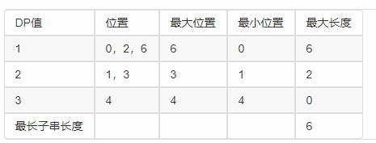

# 微软面试

目录

- [微软面试](#%e5%be%ae%e8%bd%af%e9%9d%a2%e8%af%95)
  - [一般流程](#%e4%b8%80%e8%88%ac%e6%b5%81%e7%a8%8b)
  - [算法题](#%e7%ae%97%e6%b3%95%e9%a2%98)
    - [数学](#%e6%95%b0%e5%ad%a6)
    - [字符串处理](#%e5%ad%97%e7%ac%a6%e4%b8%b2%e5%a4%84%e7%90%86)
    - [二分查找](#%e4%ba%8c%e5%88%86%e6%9f%a5%e6%89%be)
    - [并查集](#%e5%b9%b6%e6%9f%a5%e9%9b%86)
    - [maxStack](#maxstack)
    - [树](#%e6%a0%91)
    - [动态规划](#%e5%8a%a8%e6%80%81%e8%a7%84%e5%88%92)
    - [贪心](#%e8%b4%aa%e5%bf%83)
    - [√two pointers](#%e2%88%9atwo-pointers)
    - [大数据：](#%e5%a4%a7%e6%95%b0%e6%8d%ae)
  - [逻辑题](#%e9%80%bb%e8%be%91%e9%a2%98)
    - [√ 概率题（用少表示多并均匀）](#%e2%88%9a-%e6%a6%82%e7%8e%87%e9%a2%98%e7%94%a8%e5%b0%91%e8%a1%a8%e7%a4%ba%e5%a4%9a%e5%b9%b6%e5%9d%87%e5%8c%80)
    - [√ 凸包问题](#%e2%88%9a-%e5%87%b8%e5%8c%85%e9%97%ae%e9%a2%98)
      - [求包裹所有点的凸多边形](#%e6%b1%82%e5%8c%85%e8%a3%b9%e6%89%80%e6%9c%89%e7%82%b9%e7%9a%84%e5%87%b8%e5%a4%9a%e8%be%b9%e5%bd%a2)
  - [软技能(行为面试)](#%e8%bd%af%e6%8a%80%e8%83%bd%e8%a1%8c%e4%b8%ba%e9%9d%a2%e8%af%95)

  

## 一般流程
面试当天你会接受4~5轮面试，面试官一般来自两个不同manager所属的团队，公司会把面试安排在会议室。  
每轮面试一般流程为：  
* 英文自我介绍 -&gt; 算法题2+道 -&gt; 经历、性格 -&gt; 英语回答“为什么你想加入微软公司实习”
> "你为什么想要加入微软？"  
> 提这个问题，微软是想了解你是否对技术满怀热情。一个比较好的答案是：“自从我接触计算机以来我就在用微软的软件，贵公司的产品令人赞不绝口。比如，我一直在用`VS Code`学习编程，它的插件太好用了。”

## 算法题

不难，**交流很重要，要互动\(inplace or not，树里面有没有负数\)！！！**注重**代码质量（编程风格、命名规范、异常值处理）**。各种**follow up**以及要你设计尽可能多的**测试用例**。

### 数学
* **高频题**
  * ✔️[旋转图像](https://leetcode.com/problems/rotate-image)++++
    * inplace?方阵？
    * 思路：上下反转再做对角线反转。
  * ✔️[涂色问题](https://blog.csdn.net/BBHHTT/article/details/79759509)+++
    * 给定一个邻接矩阵，0代表不相邻，1代表相邻，给定k个颜色，求出每个item应该怎么涂色。
    * 思路：
      * 复杂度o\(n^3\)
      * 写一个函数判断某个点和连接的点是否颜色相同，即判断matrix\[x\]\[y\] == 1 and color\[x\] == color\[y\]，遍历y，找到不同的就可以返回1.
      * 再写个主函数遍历每次给一个点赋颜色，如果不同就一直换。
  * ✔️找数组中和为target+++
    * [找出一个数组中和为target两个数的索引](https://leetcode.com/problems/two-sum/)++
      * 把target-当前数的值存进字典，value是当前的索引。
      * 当后面的数值在字典中，说明这个数和之前某个数之和为target，取出之前的索引
    * follow up：找出一个数组里和为target的三元组
    * follow up: 找出一个数组中和为target的组合
  * 在一个数组里找任意两个数之和的绝对值最小值
    * 可以排序？可以
    * 用指针，注意指针移动条件
* **✔️最长连续子序列**
  * 给一个只包含0和1的序列，找出保证0和1的数目相同的最长连续子列。[http://www.voidcn.com/article/p-pshuooqw-mn.html](http://www.voidcn.com/article/p-pshuooqw-mn.html)
  * 把0变成-1，题目等同于求和为0的最长连续子序列，动态规划，注意要找最后一个**偶数位**的0
  * 如果子串不是从头开始怎么办？比如1101100，此时动态规划方法要调整。
    * 对每个子列和进行map映射，找相同的值的最大index之差。
    * 比如1101100
    *  
* **相亲数**
  * amicable number, 两个正整数中，彼此的全部正约数之和与另一方相等
    * 约数又叫因数，b是a的约数，则a%b==0，整除没有余数
    * 220的所有因子\(除了自己以外的因子\)：1+2+4+5+10+11+20+22+44+55+110 = 284
    * 284的所有因子：1+2+4+71+142 = 220
* **全排列**
  * 找到这个permutation在全排列中的index。[https://leetcode.com/problems/permutations/discuss/18296/Simple-Python-solution-\(DFS\).](https://leetcode.com/problems/permutations/discuss/18296/Simple-Python-solution-%28DFS%29.)
  * 
* 一道是长度为N的数组，每个元素为0或1或2，找到满足a\[i\]&lt;a\[j\]&lt;a\[k\]的\(i, j, k\)的数量
* **简单题：**
  * 求1到1000000的质数
  * 两个大数相加
  * 大整数相乘，详参见剑指offer
  * 求数组中所有数拼成的最大数
  * 判断三个数能否形成三角形，要求实现isTriangle\(int a, int b, int c\)
    * 只能判断相减是否小于，不能用两边之和大于第三边，会溢出
* [讲解](https://www.jianshu.com/p/f540a428d190)。[讲解二](https://blog.csdn.net/wangruitao1991/article/details/51678815)
  * 给 定一个函数rand100\(\)，它可以随机返回1 - 100的一个整数，要求用这个函数实现rand10000\(\)
  * follow up: 用rand100\(\)实现rand500\(\)
  * follow up 2: 用rand100\(\)实现rand150\(\)
  * 结论：如果x和y可以用rand100在确定时间内生成，那么给定一个数，问能不能用rand100在确定时间内生成
* 数组中的第k个最大数

### 字符串处理

* 字母和数字的映射问题：给定一个字母和数字的映射关系，如 1-26 对应a-z，然后输入一个数字型的字符串如“123”，请输出所有可能的字母型字符串，“abc”和“aw”和”lc”。
* [atoi函数](https://leetcode.com/problems/string-to-integer-atoi/)，字符串转整数
  * 去空格，strip\(\)
  * 字符串是否为空，空的话回0
  * 超出2^31-1或者-2^31，全都截断成2^31-1或者-2^31
  * 第一个字符正负，获取并保存符号
  * 获取数字子串，直到发现非数字字符，退出循环
* [https://leetcode.com/problems/word-break/description/](https://legacy.gitbook.com/book/lbgzmhl/microsoft-suzhou-interview/edit#)
* [https://leetcode.com/problems/integer-to-english-words/](https://legacy.gitbook.com/book/lbgzmhl/microsoft-suzhou-interview/edit#)
* 有一个只包含字母和空格的文本，输出其中所有的单词，不能用STL。
* 给一个字符串，是一个普通的英语句子，要求把里面所有单词的出现顺序反序，但是单词本身不反序，例如"This is a test" -&gt; "test a is This"
  * 注意开头结尾和中间有连续空格
* 给一个字符串，有大写和小写字母，要把所有大写字母移动到小写字母后面并保持顺序不变。
* 给一个字符串求最少删掉几个字符可以变成回文串。
* 给 定两个字符串S1 S2，如果f\(S1.substring\)=S2.substring，且 f: 改变字符串中的一个字符。请找出所有的S1.substring edit distance?
* [最长回文子串](https://legacy.gitbook.com/book/lbgzmhl/microsoft-suzhou-interview/edit#)
* 输入一个char\[\] str，要求把str中所有的"ab"都替换成"c"，把所有单个的"b"都替换成"ef"。要求in-place，并且保证str中"ab"的个数 &gt;"b"的个数（也就是str的长度足够放下替换后的结果）

### 二分查找

* +++剑指offer原题n\*m的有序数组（每行/每列）都是递增数列中如何最快的查找一个数字
* 给定一个数组，其中的元素先递减后递增，要求找出最小的那个元素的下标
* ++[https://leetcode.com/problems/search-in-rotated-sorted-array/](https://leetcode.com/problems/search-in-rotated-sorted-array/)
* partition算法！！
  * 给定一个乱序的链表，给定一个数字，把比这个数字大的结点放在后面，比这个数字小的结点放在前面，要求稳定性，即保持原数字之间的相对位置。
  * 找出数组中的中位数
* +++[top k](https://legacy.gitbook.com/book/lbgzmhl/microsoft-suzhou-interview/edit#)（我说堆排，面试官本来要问我堆的实现，我说不会堆...太菜了，面试官就没问我了）
* 在时间复杂度O\(log\(m+n\)\)的要求下寻找两个有序数组合并后的中位数；
* 链表：
  * [merge sorted array](https://legacy.gitbook.com/book/lbgzmhl/microsoft-suzhou-interview/edit#)\(easy\)
    * 从较长的数组的末尾开始填充，把两个数组末尾中较大的填充到最后，避免移动数组元素。

### 并查集

* +++[https://leetcode.com/problems/friend-circles/](https://legacy.gitbook.com/book/lbgzmhl/microsoft-suzhou-interview/edit#)
* [https://leetcode.com/problems/accounts-merge/](https://leetcode.com/problems/accounts-merge/)
* [https://leetcode.com/problems/number-of-islands/](https://legacy.gitbook.com/book/lbgzmhl/microsoft-suzhou-interview/edit#)++
* 系统中有很多个tag，tag间存在父子关系，如“iOS”和“Android”这两个tag都是“编程”这个tag的孩子。一篇文章会包含多个tag，给一个tag，输出包含这个tag以及其子tag的文章的列表。

  输入tag\_record，这其中的每一项都是一个 \(父tag，子tag\) 的二元组

  输入tag\_article，这其中的每一项都是一个 \(文章tag，文章id\)的二元组

  输入tag，即查找的tag

  输出符合的文章名列表

  解法：用字典和树，用字典根据tag来查找树中的节点，书中的某个节点对应一个tag，节点保存了tag值，以及children这个属性，children存了所有直接子tag的id。一遍遍历tag\_record后就维护了这个有父子关系的树结构，然后就可以很方便地查到输入tag以及它的子tag们，然后和tag\_article中的记录比较来查找即可。

* 找到粉丝数超过N（直接关注或间接关注）的blogger.

### maxStack

* [min Stack](https://legacy.gitbook.com/book/lbgzmhl/microsoft-suzhou-interview/edit#)
  * 实现有getmax\(\)函数的栈
  * 每次pop遍历取最大
  * 空间换时间，栈同时放两个元素\(x, curMax\)，push的时候和栈顶的比较并更新curMax，其他操作注意检查stack长度

### 树

* ++++[字典前缀树](https://leetcode.com/problems/implement-trie-prefix-tree/)
* 平衡二叉树
  * [balanced binary tree](https://legacy.gitbook.com/book/lbgzmhl/microsoft-suzhou-interview/edit#) +++
    * 1.实现一个depth递归获取当前节点的深度。isBalanced函数，递归检查是否平衡。复杂度o\(nlogn\)
    * 2.实现一个depth递归获取当前节点的深度，并检查是否平衡，用全局变量self.isBalanced来标记。避免isBalanced再重复递归了o\(logn\)
* ++有序数组构造平衡二叉树
* 二叉查找树转成有序的双向链表
* +++[验证二叉搜索树](https://leetcode.com/problems/validate-binary-search-tree/)
* 在二叉查找树中，[查找与目标值最接近的节点并返回](https://www.geeksforgeeks.org/find-closest-element-binary-search-tree/)。如果有多个节点都符合要求，返回其中一个即可
* 中序遍历树++
* 二叉搜索树 实现search node, insert node, delete node 每一个function都有问要用什么样的test case去测试，感觉有些面试官会比较看重这个。
* [https://leetcode.com/problems/lowest-common-ancestor-of-a-binary-tree/description/](https://leetcode.com/problems/lowest-common-ancestor-of-a-binary-tree/description/)
* [树的最大路径和](https://leetcode.com/problems/binary-tree-maximum-path-sum/) +++
* ++[树的最长路径](https://leetcode.com/problems/diameter-of-binary-tree/)
* [打印树的最长路径](https://www.geeksforgeeks.org/print-longest-leaf-leaf-path-binary-tree/)
* 判断一个数组是不是二叉搜索树
  * 后续遍历能用非递归写嘛？
  * 给了一个数组，没给树，判断这个数组有没有可能是一个二叉搜索树后序遍历的结
* LCA，只有两个target node，没有root
* dfs
  * [最大子矩阵](https://leetcode.com/problems/maximal-square/solution/)：最大正方形。在一个二维01矩阵中找到全为1的最大正方形。
  * [https://leetcode.com/problems/maximal-rectangle/](https://leetcode.com/problems/maximal-rectangle/)

### 动态规划

* +++卖股票[https://leetcode.com/problems/best-time-to-buy-and-sell-stock/](https://leetcode.com/problems/best-time-to-buy-and-sell-stock/)
  * follow up: 多次交易最大++
* +++一个n \* m的棋盘上，起点在左上角，终点在右下角，每个位置上有不同的金额。只能向左边和下边两个方向移动，要求找到最大的金额以及路径。[minimum-path-sum](https://leetcode.com/problems/minimum-path-sum/)
* [https://leetcode.com/problems/path-sum/](https://leetcode.com/problems/path-sum/)

  [https://leetcode.com/problems/path-sum-ii/](https://leetcode.com/problems/path-sum-ii/)

  [https://leetcode.com/problems/path-sum-iii/](https://leetcode.com/problems/path-sum-iii/)

### 贪心

* 第一道题是已知n个节目的开始结束的时间，问最多能看多少节目。当然我知道这个就是个O\(n\)的贪心
  * 435. Non-overlapping Intervals
  * [https://leetcode.com/problems/non-overlapping-intervals/](https://leetcode.com/problems/non-overlapping-intervals/)

### √two pointers

* 判断链表是否有环
  * 141. Linked List Cycle\([https://leetcode.com/problems/linked-list-cycle/](https://leetcode.com/problems/linked-list-cycle/)\)
  * 判断两个链表是否相交是求链表是否存在环的变式，如给定两个链表A和B
    * A遍历自己，一直到终点再从B开始。B也如此，遍历完自己再遍历A。
    * 如果中间有相同节点了，那么就相交，否则不相交。
    * 因为如果相交的话，那么都会走到len\(A\)+len\(B\)-len\(A∩B\)的地方停下来
* 判断链表是否有环，并找到入口节点
  * 142. Linked List Cycle\([https://leetcode.com/problems/linked-list-cycle-ii/](https://leetcode.com/problems/linked-list-cycle-ii/)\)
* 给一个链表头，返回是单链表还是环链表，然后再补一个给一个链表头返回长度的。

  怎么判断一个链表有环啊

### 大数据：

* 数据流中位数[https://leetcode.com/problems/find-median-from-data-stream/](https://leetcode.com/problems/find-median-from-data-stream/)
* [十亿数排序](https://legacy.gitbook.com/book/lbgzmhl/microsoft-suzhou-interview/edit#) [总结](https://legacy.gitbook.com/book/lbgzmhl/microsoft-suzhou-interview/edit#)
* 拓扑结构

## 逻辑题

### √ 概率题（用少表示多并均匀）

* 给一串只包含0~9的数字串，每个数字出现的概率相同（比如32978417506），现在告诉你（1,3,5,7）这四个数字不可用，即只能用（0,2,4,6,8,9）这6个数，如何表示原数字串？
  * 00表示0, 02表示1, 04表示3， 06表示5， 08表示7
  * 15位表示以前的10位，所以存储多出来0.5倍

### √ 凸包问题

#### 求包裹所有点的凸多边形

* 穷举法O\(n³\)
  * 思路：两点确定一条直线，如果剩余的其他点都在这条直线的一侧，则这两个点是凸包上的点，否则就不是。
  * 步骤：1.将点集里面的所有点两两配对，组成 n\(n-1\)/2 条直线。2.对于每条直线，再检查剩余的n-2个点是否在直线的同一侧。
  * 结果为正时则\($$x_3, y_3$$\)在直线左侧，为负在右侧

* 分治法O\(nlogn\)
  * 思路：找到凸包点，分割点集，在子点集上继续找凸包点
  * 步骤：
    * 找到横坐标最大的P1和P2肯定是凸包点，分割为上下包
    * 对上包，求**距离直线最远的点（公式如上）**，即图中Pmax
    * 把P1Pmax的左侧和PnPmax的右侧当上包
    * 重复第二三步，对下包也这样

* 步进法O\(nH\)
  * H是闭包点的个数。
  * 思路：

    * 先找纵坐标最小的点加入闭包
    * 从P0开始，逆时针找点集上使alpha角\(和x轴夹角\)最小的点，即P1
    * 从P1出发，逆时针找点集上使alpha角\(P0P1和P1P?夹角\)最小的点，即P2
    * 重复，直到回到P0。注意共线时点都加入闭包，但选最远点为下一次的出发点。

* Graham扫描法O\(nlogn\)

## 软技能(行为面试)
面试官希望知道你在这个项目中哪一项能力得到了最大的提高。
